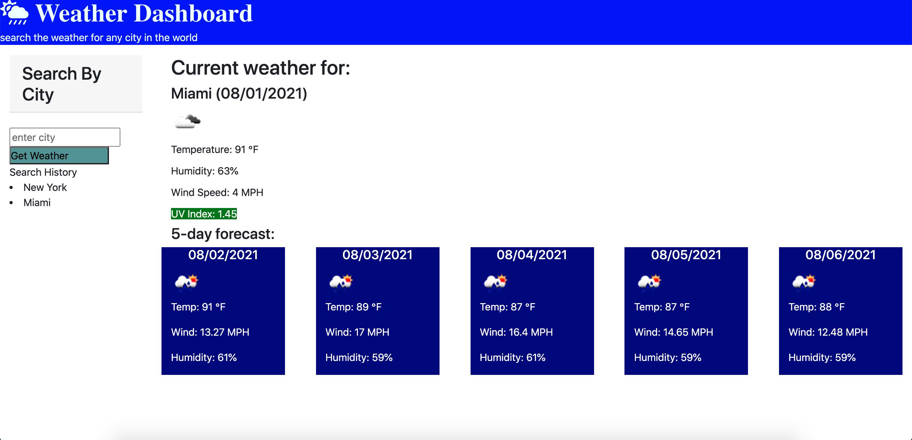
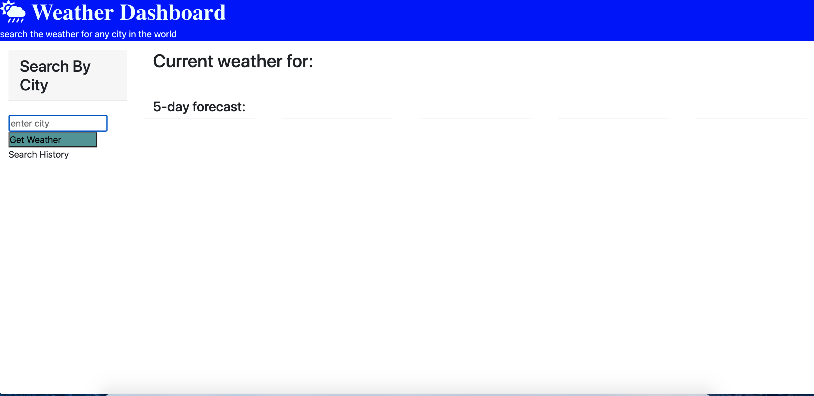
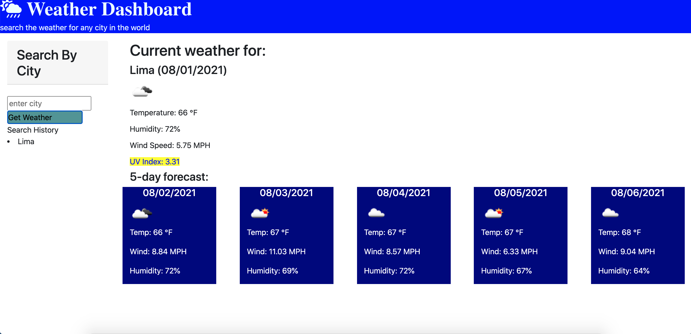

# Work-Day-Scheduler

## Purpose
The Weather Application using weather API provides you the current weather, date, wind and UV index more so you can go out safe knowing if the conditions are favorable. Also, it renders a 5 day forecast of the city you are vacationing so you can plan ahead. The search history allows you to see the cities you already viewed and allows you to view them again. This powerful application is brought to you by openweathermap.com and also uses:

* HTML
* CSS
* Javascript
* DOM
* JQuery
* BootStraps
* Moment.js

## Website

https://walterlaw19.github.io/weather-dashboard/

## Screenshots

 "Screenshot1"
 "Screenshot2"
 "Screenshot3"


## contribution
```
Made by by Walter G
```

---
##### © 2021 WG.